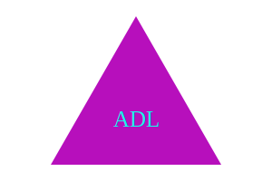
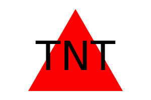
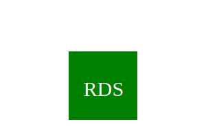

# Logo Generator  

  ## Description

  This project was developed to assist the end user in creating a logo, where he can insert up to three characters such as initials, shapes and desired colors. Then, based on the information provided, a logo is created.

  ## Table of Contents
  - [Installation](#installation)
  - [Usage](#usage)
  - [License](#license)
  - [Contributing](#contributing)
  - [Credits](#credits)
  - [Questions](#questions)
  
  ## Installation

  Navigate to https://github.com/robinsonfdossantos/Logo-Generator.

  Open a local built-in Terminal (powershell, bash) on your local machine.

  Navigate to a desired folder to place your project in, using 'cd "folder"'.

  Use 'git clone' to copy the repository to your local computer by typing "git clone git@github.com:robinsonfdossantos/Logo-Generator.git".
  
  ## Usage

  Run the terminal built into VS Code. Make sure you have installed all required packages using 'npm install or npm i' command, then run the program using 'node index.js or npm start' command.

  Go through all the questions, after you finish answering all of them a logo will be created and a copy will be saved in the ./examples directory with the name of the initials you used to create the logo, you can use the same name for different logos , but when saving it, a number will be added to its name to avoid duplicate files.
  
  After receiving the message that the logo has been created, you must open it in a browser to check the final result.

  Watch the video below to see the application in action.

  https://drive.google.com/file/d/1K30MHGKcb4bRLiWCdKripgNOJp2RQCc2/view

  Use the link below to have more hexadeciaml color options.

  https://htmlcolorcodes.com/

  ## Examples

  These are some examples of logos created by the application.

   
    
 

  ## License

  This application is covered under the MIT license.
  
  ## Contributing

  All users are very welcome to leave their comments and suggestions for improvement by sending me a direct message or creating pull requests on Github.
  
  ## Credits

  Meeks Gombe, Dominique who helped me to understand and overcome all my doubts through a 1:1 tutor session.

  SVG library.
  
  ## Questions

  For any questions or inquiries, please reach out to me via [GitHub](https://github.com/robinsonfdossantos) or email me at robinsonfdossantos@gmail.com.
  